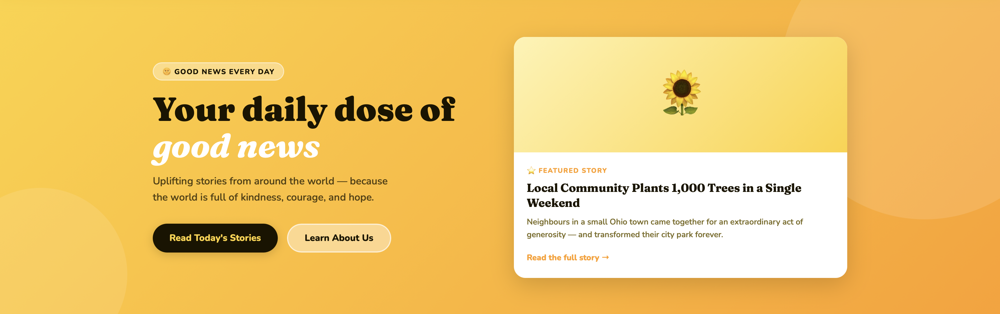
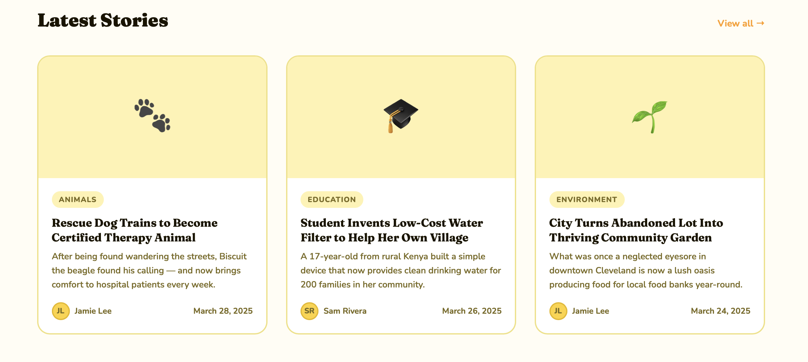

# 🌻 Project Uplift — FeelGoodNews

> A feel-good news website delivering uplifting stories every day. Built with HTML, CSS & vanilla JavaScript.

### Homepage
.png)
.png)

---

## 🌟 About

FeelGoodNews is an uplifting news website dedicated to sharing positive, feel-good stories from around the world. In a world full of negativity in the news cycle, we believe there is always good worth celebrating — acts of kindness, community heroes, environmental wins, and inspiring people making a difference every day.

The site is written by real journalists and updated regularly with new stories.

---

## ✨ Features

- **Hero banner** with a featured story and daily tagline
- **Story card grid** showcasing the latest articles
- **Newsletter signup** so readers never miss a story
- **Lightweight file-based CMS** — new stories are added by editing a single JavaScript file, no database required
- **Fully responsive** — works on desktop and mobile
- **Fast and lightweight** — no frameworks, no dependencies, just HTML, CSS, and vanilla JS

---

## 📸 Screenshots

### Hero Section


### Story Cards


### Newsletter Section


---

## 📁 File Structure

```
Project-Uplift/
├── index.html       → Page structure (navbar, hero, story grid, footer)
├── style.css        → All styling, colors, fonts, and layout
├── stories.js       → CMS — add and manage stories here
├── images/          → Store your story photos here
└── screenshots/     → Screenshots for this README
```

---

## 🚀 Getting Started

### View locally
1. Clone or download this repository
2. Open the `Project-Uplift` folder in [Visual Studio Code](https://code.visualstudio.com/)
3. Install the **Live Server** extension (search for it in the Extensions panel)
4. Right-click `index.html` and select **"Open with Live Server"**
5. The site will open in your browser and auto-refresh when you save changes

### Or simply open in your browser
Double-click `index.html` — it will open directly in your browser with no setup needed.

---

## 📝 How to Add a New Story

All stories are managed inside `stories.js` — no database or backend required.

1. Open `stories.js`
2. Copy an existing story object and paste it at the **top** of the `STORIES` array (newest stories appear first)
3. Fill in the fields:

```js
{
  emoji:   "🎉",                   // placeholder shown until you have a real photo
  imgUrl:  "images/my-photo.jpg",  // leave as "" if using emoji placeholder
  tag:     "Community",            // short category label
  title:   "Your headline here",
  excerpt: "A short 1–2 sentence summary of the story.",
  author:  "Journalist Name",
  date:    "April 1, 2025",
  url:     "article.html"          // link to the full article page (use "#" for now)
}
```

4. Save the file — the homepage updates automatically!

### To add a real photo
1. Drop your image into the `images/` folder
2. Set `imgUrl` to `"images/your-filename.jpg"`
3. You can leave `emoji` as `""` once you have a real image

### To change the Featured Story
Scroll down to the `FEATURED_STORY` object in `stories.js` and update it the same way.

---

## 🎨 Customization

| What you want to change | Where to change it |
|---|---|
| Colors and fonts | `style.css` — edit the `:root` variables at the top |
| Logo / site name | `index.html` — find the `.nav-logo` element in the nav |
| Tagline in hero | `index.html` — find the `<h1>` inside `.hero-text` |
| Footer links | `index.html` — find the `<footer>` section |
| Stories and articles | `stories.js` |

---

## 🗺️ Roadmap

Planned features for future versions:

- [ ] Individual article pages
- [ ] About page
- [ ] Contact page
- [ ] Categories / tag filtering
- [ ] Search functionality
- [ ] Mobile app
- [ ] Newsletter integration (Mailchimp / ConvertKit)
- [ ] Comment section

---

## 🛠️ Built With

- HTML5
- CSS3
- Vanilla JavaScript
- [Google Fonts](https://fonts.google.com/) — Fraunces & Nunito

---

## 👥 Team

| Role | Name |
|---|---|
| Co-Founder & Developer | Hamza Farah |
| Co-Founder & Developer | Layton Perry |

> Journalists will be listed here once we begin publishing articles.

---

## 📬 Contact

Have a story tip or want to get in touch?

> 📧 A dedicated contact email is coming soon — stay tuned!
>
> *Example: hello@feelgoodnews.net*

---

## 📄 License

© 2025 Project Uplift / FeelGoodNews. All rights reserved.